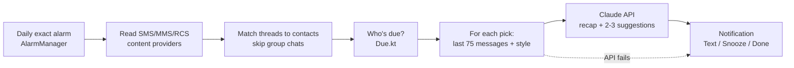

# Heyu

**A personal Android app for people who are bad at texting back.** You choose how often you want to be in
touch with each person. Once a day Heyu checks your messages, tells you who you're overdue with (and who's
waiting on a reply), and suggests a text written in your own voice by Claude.

> Status: personal tool, sideloaded onto a Pixel. Not on the Play Store (see [Launch considerations](#launch-considerations)).
> The Android package is still `com.example.textinghelper` (renaming it would reset the app's data on the phone).

---

## Contents
- [Features](#features)
- [How it works](#how-it-works)
- [Reminder rules](#reminder-rules)
- [AI suggestions](#ai-suggestions)
- [Texting styles](#texting-styles)
- [Privacy and data](#privacy-and-data)
- [Setup](#setup)
- [Using the app](#using-the-app)
- [Project structure](#project-structure)
- [Development notes](#development-notes)
- [Costs and resource use](#costs-and-resource-use)
- [Known limitations](#known-limitations)
- [Launch considerations](#launch-considerations)
- [Logo](#logo)

---

## Features

- **Per-person cadence:** Weekly, Biweekly, Monthly, Quarterly, Custom (any number of days), or Ignore.
  Everyone starts on Ignore; you opt people in.
- **Daily reminder** at a time you choose, capped at a set number of people per day.
- **"You never replied" reminders** that take priority over regular check-ins.
- **Suggested texts from Claude,** written in your style from your recent conversation with that person
  (including photos and video frames), with a recap of what's already happened so it doesn't ask about
  finished plans.
- **Texting styles** (Friends, Family, Professional) built from sample chats you pick, plus your own rules
  and a "never use" word list that's enforced.
- **Notification actions:** Text (opens Google Messages with the suggestion prefilled), Snooze 3 days, Done.
- **Varied timing:** every other reminder comes a day or a few early or late, so you're not texting on an
  obvious schedule.
- **Home screen** with who's due now, who's coming up, and what you recently handled.
- **AI usage tracking:** exact token counts and estimated cost per suggestion.
- **Works offline for everything but suggestions:** no account, no server; everything lives on the phone.

## How it works



1. **Read messages.** Android keeps texts in system databases ("content providers") that apps can query
   read-only. Heyu reads `content://sms` and `content://mms`. On a Pixel, Google Messages also stores
   **RCS** chats in the MMS table, so those are included.
2. **Find 1:1 conversations.** Each thread's participants come from `content://mms-sms/conversations`.
   Threads with more than one other person are group chats and are skipped. RCS group chats show up as a
   single fake address like `…@rcs.google.com` and are skipped too.
3. **Match to contacts** by normalized phone number (`+1 (555) 123-4567` and `555-123-4567` are the same).
4. **Decide who's due** (rules below), apply the daily cap, and post notifications.
5. **Draft suggestions** with Claude for each person being reminded. If there's no API key or the call
   fails, the reminder still goes out without a suggestion.

The full message scan (~180k messages on the dev phone) takes a few seconds. Its results are cached so the
app opens instantly and refreshes in the background.

## Reminder rules

All in [`Due.kt`](app/src/main/java/com/example/textinghelper/Due.kt) (pure Kotlin, unit tested).

| Rule | Detail |
|---|---|
| **Due** | Days since *your* last text to them, or since you tapped Done, is at least their cadence, and they aren't snoozed. Texting someone naturally resets their clock. |
| **Unreplied** (higher priority) | They sent the last message, it's been more than 2 days, and you haven't tapped Done since. Opted-in contacts only, so verification codes never trigger this. |
| **Recent incoming** | If they texted you in the last 2 days, no reminder at all, not even a due one; you already know about them. |
| **Order** | Unreplied first (longest waiting first), then due (most days past their cadence first), then the daily cap. |
| **Repeats** | Anyone still due is reminded at every daily check until you text them, snooze them, or tap Done. |
| **More due than the cap** | Setting, default **Rotate**: within each group, whoever was reminded longest ago goes first, so everyone takes turns. **Most overdue first** keeps the strict order. |
| **Nobody due** | The daily check sends a silent "Nobody to text today" notice (with who's next), and Settings shows what the last check did. |
| **Snooze** | Hidden for 3 days. |
| **Done** | Counts as if you texted them: resets their clock and clears "unreplied". |
| **Changing a cadence** | A fresh start: clears Done, snooze and the no-repeat window, so the clock goes back to your last real text. |
| **Varied timing** (on by default) | Each cycle (starting when you text them or tap Done) alternates shifted / normal. Shifts are random earlier or later: ±1 day for 7–29 day cadences, ±2–3 days for 30+, none under a week. Unreplied reminders are never shifted. |

The daily check runs from an **exact alarm** at your chosen time (`DailyAlarm` in `Reminders.kt`), the same mechanism
alarm-clock apps use, so it fires on time even when the phone is idle. Each alarm runs the check and arms the next
day's; the alarm is also re-armed when the time is changed, the app is opened, the phone restarts, or the app is
updated. Opening the app never runs a check itself. (An earlier version used a periodic WorkManager job, which Android
could hold overnight and then run the moment the app was opened.)

## AI suggestions

In [`Suggest.kt`](app/src/main/java/com/example/textinghelper/Suggest.kt). One call to the Claude Messages API
per reminder, made directly over HTTPS with OkHttp.

**Model:** `claude-sonnet-5`, effort `medium`, with a JSON schema on the output so the reply always parses.

**What Claude is sent:**

| Part | Contents |
|---|---|
| System prompt | Who it's writing as, the priority order (your rules > this conversation > style profile), how to recap, and how to write the suggestions |
| Your rules | Style notes and banned words, as hard rules at the end of the system prompt |
| Style section | Your texting-style description and 15–20 of your real texts, for this contact's style |
| Conversation | Your last **75** messages with this person as `[timestamp] Me:` / `Them:`: the last **25** as *RECENT CONVERSATION (most relevant)*, the rest as *OLDER CONTEXT (background only)* |
| Media | Up to 3 of the newest photos/videos from the recent section, shrunk to 1000px JPEGs. A video becomes 3 frames: first, middle, last. Voice notes stay as `[voice message]` |
| Metadata | Days since the last message, who sent it, and whether it's an unreplied reminder |
| Gap rule | Under 6 weeks since the last message, it must not mention that it's been a while |

**What comes back:**
```json
{"recap": "what happened; which plans are DONE vs OPEN",
 "suggestions": [{"text": "...", "angle": "follow-up|check-in|make-plans|reply"}]}
```
The recap comes first on purpose: writing down what's already resolved before suggesting anything stops
it from asking about plans that already happened. A plan whose date has passed counts as done unless
something says it was cancelled.

**Rules and banned words are enforced in code, not just requested.** Any suggestion containing a banned word
(whole-word, any case) is thrown out; if they all are, Claude is asked once more with the word called out.
Bans come from the "Never use" field and from notes like `don't use "yo"`.

The notification shows the first suggestion. Tapping it opens a screen with all of them, Claude's recap,
and a "View prompt" button showing exactly what was sent. The recap and button can be turned off in Settings.

## Texting styles

In [`Styles.kt`](app/src/main/java/com/example/textinghelper/Styles.kt). Settings → Text Style Settings has a
tab each for **Friends, Family and Professional**:

1. Pick up to 5 sample chats per style. They're assigned that style automatically.
2. Optionally write notes (treated as rules) and a "never use" list.
3. **Build:** Heyu reads up to 250 of *your own* messages from each chat, drops reactions ("Loved “…”") and
   photo-only messages, and sends them to Claude as unnamed "Chat 1, Chat 2…". Claude returns a short
   description of how you text plus 15–20 of your real messages as examples. Any example that isn't word
   for word one of your messages is discarded.
4. Review, edit the description, or remove examples; Rebuild anytime.

Each contact's style is set from the People tab. Contacts without one use Friends. Style builds cost about
$0.07–0.12 each and show up in the usage log.

## Privacy and data

- **Read-only:** Heyu never sends, edits or deletes messages. The Text button just opens Google Messages with a draft.
- **What leaves the phone:** only calls to Anthropic's API, and only with a key set:
  - For each reminder, the last 75 messages with that person (plus up to 3 recent photos/videos, shrunk).
  - For each style build, up to 250 of your own messages per sample chat, with no names.
  - People on Ignore are never sent.
- **Stored on the phone only:**

| Data | Where |
|---|---|
| Cadences, styles, snooze/done state, reminder and usage log | Room (SQLite) database `app.db` |
| Settings and style profiles | SharedPreferences |
| Claude API key | EncryptedSharedPreferences (Android Keystore-backed) |
| Message-scan cache | `files/diagnostic.bin` |
| Latest prompt, recap and suggestions per person | `files/prompts/` |

- The API key is never in this repo, and the app checks it with Anthropic (free, no tokens) before saving.

## Setup

**Requirements**
- Windows with Android Studio (for the Android SDK and bundled JDK)
- An Android phone with Android 13+ and USB debugging on
  (Settings → About phone → tap Build number 7×, then Developer options → USB debugging)
- Optional: a Claude API key from [console.anthropic.com](https://console.anthropic.com) for suggestions

**Build and install (PowerShell)**
```powershell
$env:JAVA_HOME = "C:\Program Files\Android\Android Studio\jbr"
.\gradlew assembleDebug
& "$env:LOCALAPPDATA\Android\Sdk\platform-tools\adb.exe" install -r app\build\outputs\apk\debug\app-debug.apk
```
Or open the project in Android Studio and press Run.

**Run the tests**
```powershell
.\gradlew testDebugUnitTest
```

**First run**
1. Grant access to SMS, contacts and notifications.
2. On Home, tap **Allow** on the battery card so the daily check runs on time.
3. Settings → Claude Settings → add your API key (optional).
4. People → set cadences for the people you want reminders for.
5. Settings → Text Style Settings → build at least the Friends style (optional, improves suggestions).
6. Settings → Testing Settings → **Run check now** to try it immediately.

## Using the app

| Tab | What's there |
|---|---|
| **Home** | Due now (with Text / Snooze / Done), coming up in the next days, recently handled, battery prompt |
| **People** | Every contact you've texted: search, sort (Most texted, A–Z, Recently texted, Cadence), "Opted in" filter, cadence and style buttons |
| **Settings** | **Notification Settings** (time, daily cap, varied timing), **Claude Settings** (API key, latest suggestions/recap/prompt per person), **Text Style Settings**, **Testing Settings** (recap and prompt toggles, test notification, run check now) |
| **Data** | AI usage (last 30 days: tokens, cost, per-suggestion list) and a data diagnostic (message counts, threads, unmatched numbers, per-contact dates) |

## Project structure

```
app/src/main/java/com/example/textinghelper/
  MainActivity.kt        App entry: permissions, tabs, cached/background message loading, Data tab
  HomeScreen.kt          Home tab and battery-optimization prompt
  SetupScreen.kt         People tab: search, sort, cadence and style pickers
  SettingsScreen.kt      Settings tab: sections, API key entry, latest suggestions
  StylesSection.kt       Text Style Settings: per-style tabs, sample picker, build, profile editing
  SuggestionsActivity.kt Screen opened from a notification: all suggestions, recap, View prompt
  Messages.kt            Reading SMS/MMS/RCS and contacts, group-chat filtering, phone normalization, cache
  Due.kt                 Reminder rules, upcoming dates, varied timing (pure logic)
  Reminders.kt           Daily job, notifications and their actions, settings accessors
  Suggest.kt             Claude API call, prompt building, parsing, banned-word enforcement, key check
  Styles.kt              Style profiles: storage, prompt section, building with Claude
  Db.kt                  Room database: ContactSetting, ReminderLog, migrations
app/src/test/...         Unit tests (JVM, no device needed)
docs/logo/               Logo spec, SVGs and generator
```

**Stack:** Kotlin, Jetpack Compose (Material 3), Room, WorkManager, OkHttp, org.json,
EncryptedSharedPreferences. Min SDK 33, target SDK 37, AGP 9.

## Development notes

- **Database migrations:** the Room schema is at version 5, and each version bump has a hand-written
  migration in `Db.kt`, so updates never wipe your settings. Add a new migration for every schema change.
- **Tests:** 26 unit tests cover the reminder rules, varied timing, prompt building, response parsing,
  banned-word matching, style sections and the cache. Android-specific code (content providers,
  notifications, API calls) is tested on the device.
- **Debugging on the phone:** `adb shell content query --uri content://mms --projection …` reads the same
  providers the app does. Settings → Testing → **View prompt** shows exactly what Claude saw.
- **Pricing constants** for the cost estimates are hardcoded in `Suggest.kt` (Sonnet 5: $2 / $10 per million
  input / output tokens). Update them if the model or pricing changes.
- `ponytail:` comments mark deliberate simplifications, each with its limit and how to upgrade.

## Costs and resource use

Measured on the dev phone (~184k messages, 354 contact numbers):

| | |
|---|---|
| App data | ~90 KB (database 60 KB, cache 17 KB, settings 12 KB); under 1 MB after years |
| Install size | ~49 MB debug build (a size-optimized release build would be much smaller) |
| Daily processing | A few seconds of CPU for the message scan, plus about 3 API calls |
| Per suggestion | ~$0.01–0.02 typical on Sonnet 5 (more with photos); exact numbers in the Data tab |
| Per month | Bounded by the daily cap: ~90 suggestions, roughly $1–2 |

## Known limitations

- **Android only.** iPhones don't let apps read messages.
- **RCS depends on the phone.** Verified on a Pixel with Google Messages. Other phones or messaging apps may
  store RCS where apps can't read it.
- **Group chats are ignored,** including for context. If a plan was settled in a group chat, suggestions won't know.
- **History** starts wherever the phone's message database starts (for example, when the phone was set up).
- **Daily check timing** relies on an exact alarm; some manufacturers (Samsung, Xiaomi, OnePlus…) may still delay background work unless the app is also exempted in their own battery settings.
- **Only exact words can be banned.** Free-text notes ("keep it short") are strong instructions, but the model can still slip.

## Launch considerations

Not needed for personal use, but required before a public release:

1. **Google Play's SMS policy** restricts reading SMS to default messaging apps and a few approved uses; a
   reminder app likely wouldn't qualify. Options are distributing outside the Play Store or building a full SMS app.
2. **A backend to hold the API key.** A key shipped inside an app can be extracted, so a small server
   would need to proxy calls, authenticate users, rate-limit, and handle billing.
3. **Privacy policy and consent,** since other people's messages are sent to an AI provider.
4. **Cost controls:** the Batch API would halve suggestion costs, since reminders aren't time-critical.
5. **Package rename** from `com.example.textinghelper`. Note that this is treated as a new app and resets local data.

## Logo

An hourglass whose halves are chat bubbles, in pumpkin orange. Spec, SVGs and the generator script are in
[docs/logo](docs/logo/README.md).
